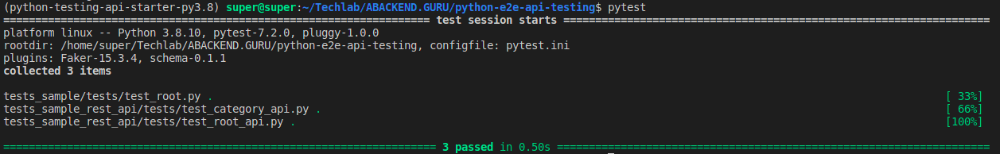

# Python E2e API Testing

Starter template for quickstart API Testing with Pytests, Flake8.

Forcusing on testing for the API support Restful and Graphql with most popular cases.

The tests is place in the sample directory so you can reference anytime.

For your application just create new directory named `myapp` or any thing you want.

## Sample

In this project, we will write the test cases for sample api named: sample-rest.abackend.guru.


### Test Google home

```shell
pytest tests_google
```

### Test Github API

```shell
pytest tests_github
```

## Quickstart

### Setup environment with poetry

```shell
poetry shell
poetry install
```

Run tests

```shell
pytest
```


Result




### To start new E2E Test project

Just copy the `tests_sample` directory and write your test cases.

```shell
cp tests_sample tests_<your_project_name>
pytest tests_<your_project_name>
```

Example:

```shell
cp -r tests_sample/ tests_abackendguru_com
pytest tests_abackendguru_com
```

## Features

### Restful API Tests

- [ ] 1. Testing HTTP call GET, POST, PUT, DELETE and more.
- [ ] 2. Testing file upload.

### GraphQL API Tests

updating...

## Run tests

Run tests ny this command

```shell
pytest
```

## Quickstart your E2E API Testing project
