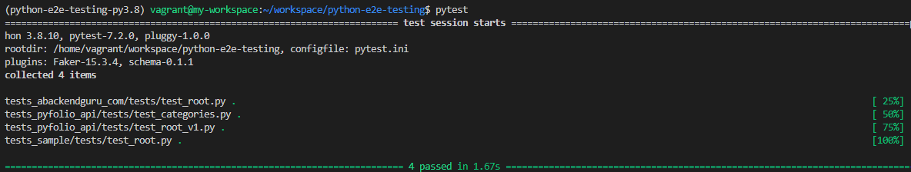

# Python E2e API Testing

Starter template for quickstart API Testing with Pytests, Requests, Flake8.

Forcusing on testing for the API support Restful and Graphql with most popular cases.

The tests is place in the sample directory so you can reference anytime.

For your application just create new directory named `myapp` or any thing you want.

## Quickstart

### Setup environment with poetry

```shell
poetry shell
poetry install
```

Run tests

```shell
pytest
```

Result



### Start new E2E Test project

Just copy the `tests_sample` directory, change base url and write your test cases.

```shell
cp tests_sample tests_<your_project_name>
pytest tests_<your_project_name>
```

Example:

**Create e2e tests for abackendguru.com site.**

Step 1: Copy test sample

```shell
cp -r tests_sample/ tests_abackendguru_com
pytest tests_abackendguru_com
```

Step 2: Change base url in tests/configs.py

```python
REST_API_BASE_URL: str = 'https://abackendguru.com'
```

Step 3: Run tests

```shell
pytest tests_abackendguru_com
```


